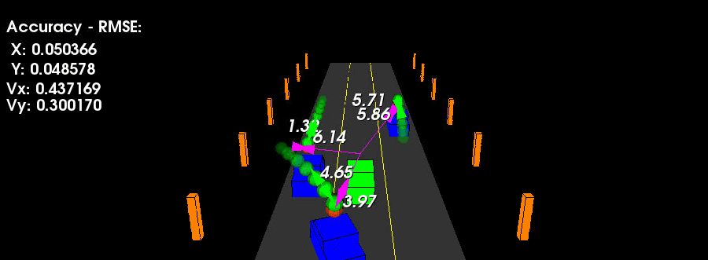

# Unscented Kalman Filter Project
Sensor Fusion Nanodegree Program

In this project, I utilized an Unscented Kalman Filter to estimate the state of a moving object of interest with noisy lidar and radar measurements. I passed the project requirements and obtained RMSE values that are far lower that the tolerance threshold. The environment is a straight 3 lane highway with 3 traffic cars and the main ego car at the center. The viewer scene is centered around the ego car and the coordinate system is relative to the ego car as well. The ego car is green while the other traffic cars are blue. The traffic cars will be accelerating and altering their steering to change lanes. Each of the traffic car's has it's own UKF object generated for it, and will update each individual one during every time step. The red spheres above cars represent the (x,y) lidar detection and the purple lines show the radar measurements with the velocity magnitude along the detected angle. The Z axis is not taken into account for tracking, so we are only tracking along the X/Y axis.

---

## The filter Design

The below flow chart shows my code structure. the data is checked and fused into an unscented Kalman filter, and the Kalman filter will output the best estimating to the second order accuracy of the nonlinear model.

---

## Important Dependencies
* cmake >= 3.5
  * All OSes: [click here for installation instructions](https://cmake.org/install/)
* make >= 4.1 (Linux, Mac), 3.81 (Windows)
  * Linux: make is installed by default on most Linux distros
  * Mac: [install Xcode command line tools to get make](https://developer.apple.com/xcode/features/)
  * Windows: [Click here for installation instructions](http://gnuwin32.sourceforge.net/packages/make.htm)
* gcc/g++ >= 5.4
  * Linux: gcc / g++ is installed by default on most Linux distros
  * Mac: same deal as make - [install Xcode command line tools](https://developer.apple.com/xcode/features/)
  * Windows: recommend using [MinGW](http://www.mingw.org/)
 * PCL 1.2

## Basic Build Instructions

1. Clone this repo.
2. Make a build directory: `mkdir build && cd build`
3. Compile: `cmake .. && make`
4. Run it: `./ukf_highway`

---

## References

1. [Eigen - Quick Reference Guide](https://eigen.tuxfamily.org/dox/group__QuickRefPage.html)
2. Udacity Unscented Kalman Filter